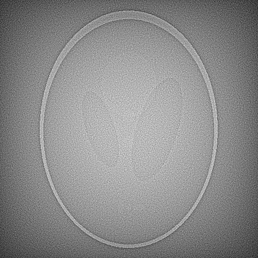

# Homework Sheet 4

## Part 1: Setup

### Dataset:

Shepp-Logan phantom is used in homework 1,2 and 4. The Helsinki Tomography Challenge 2022 open tomographic dataset (HTC 2022) is used in Homework 3. Lena is used in homework 1 part (ii) for the deblurring problem.

### Result reproducability:

In homework 1, the contour plot to demonstrate the working of the optimization algorithm can be reproduced by running hw04_demo.ipynb section 1. The deblurring example of homework 1 can be reproduced by running section 3. CT reconstruction results are reproduced by running script04.py.

In homework 2, run script04_2.py to show the semi-convergence result.

In homework 3, run script04_3.py to replicate the Helsinki Tomography Challenge reconstruction results. To run on local environment, change line 14: data_path = (dataset["data_path"])["server"] to data_path = (dataset["data_path"])["local"]
To illustrate different phantom on the dataset, change line 15 to any "phantom1a" to "phantom7c". See also hw04_2.ipynb for simple experimentation.

In homework 4, run script04_4.py to demonstrate the CT reconstruction with various finite difference operator. See also hw04_2.ipynb for simple experimentation.

## Part 2: Experimental methods and results

### Homework 1: Even more gradient based methods

Homework 1, implementation of (i) backtracking, (ii)  Iterative Shrinkage-Thresholding Algorithm (ISTA) and (iii) Projected Gradient Descent (PGD) are in GradientDescent.py beginning from line 244.

#### Simple 2D experiment on contour plot

To illustrate the performance of the algorithm, a simple 2 dimensional least square problem of the form Ax=b is solved, where A = [2 1; 1 1] and b = [1; 1] and the solution x is supposed to be [0; 1]. the starting point is chosen to be [15,15]. The algorithm are evaluated based on the closeness to the solution and its iteration number. Results are in hw04_demo.ipynb section 1. Out of the 3 methods, stepsize computed with Barzilai and Borwein 1 and 2 (BB1 BB2) method delivers the best performance in terms of accuracy and iteration number. ISTA is used to solve the equation formulated into a LASSO problem with regularization strength $\beta$=0.01 as it gives the best results. ISTA is implemented where the initial step size $\alpha=\dfrac{1}{L} $, where L is the Lipschitz constant computed using power interation implemented in the previous homework, when backtrack condition is turn on, it will evaluate the new $\alpha$ based on the initial step size. In this experiment, the result remains the same regardless of whether backtracking is applied, perhaps the default initial step size is already the optimal step size.The projected gradient is performed by projecting into a set with lower and upper bound of [-1,-1] and [5,5] respectively because the solution is within this boundary. At last, OGM1 is performed where the Lipschitz constant is chosen to be the spectral norm $||A||_{2}$, this methods oscillatates wildly near the solution and require much more number of iterations than the other proposed method. Finally, conjugate gradient method converges to a solution in only n iteration.

#### Deblurring experiment (ISTA)

ISTA is compared against regular GD with tikhonov regularization but with same regularization strength it is found that the latter performs better, see result in the notebook.

#### CT reconstruction

8 experiments are performed to demonstrate the methods in homework 1 against methods implemented in previous homework, all initial starting point are set to random value between 0 and 1

| Experiment | Optimization Algorithm    | Parameters   | Explation   |
| :---:   | :---: | :---: | :---: |
| 1 | GD with backtrack  | con1=0.5, con2=0.5|
| 2 | BB1   |    |
| 3 | BB2   |    |
| 4 | ISTA   | $\beta$=0.1   |
| 5 | ISTA with backtrack   |  $\beta$=0.1  |
| 6 | PGD   | lower bound= -0.01, upper bound=0.01  | chosen because min and max value of image is within this range
| 7 | GD   |  tikhonov, $\beta$=5  |
| 8 | GD   |  huber, $\beta$=5, $\delta$=1,   |
| 9 | GD  |   fair potential, $\beta$=5, $\delta$=1,  |

**table 1**

*Abbreviation:*

*1. Control parameter for backtracking linesearch, con1& con2*

**Reconstruction result**

    
    
    
    
    
    
    
    
    

**Convergence analysis**

    
    
    
    
    
    
    
    
    
 

 
**Figure 1-9, following the order of the experiment in table 1 above from left to right. If unsure, hover over each diagram to read the description**

### Homework 2: Semi-Convergence

8 experiments are performed to show existence of semi-convergence properties. Gaussian noise of mean 0 and variance $\sigma^2$ is added to the sinogram. For ease, step sizes of GD are chosen to be 0.001 unless stated.

| Experiment | Optimization Algorithm    | Noise ($\sigma^2$)|Parameters   | Explation   |
| :---:   | :---: | :---: | :---: | :---: |
| 1 | GD | 5 |tikhonov, $\beta$=5 |
| 2 | OGM1 | 5 |tikhonov, $\beta$=5 |
| 3 | Landweber   | 5 |   |
| 4 | Conjugate Gradient (CG)  | 5 |   |
| 5 | GD  | 10 |tikhonov, $\beta$=5 |
| 6 | OGM1   | 10 |tikhonov, $\beta$=5  |
| 7 | Landweber   | 10 |   |
| 8 | Conjugate Gradient   | 10 |   |

**table 2**

**Reconstruction result**

* NOISE, $\sigma^2$=5 *

    
    
    
    

* NOISE, $\sigma^2$=10 *

    
    
    
    

**Convergence analysis**

* NOISE, $\sigma^2$=5 *

    
    
    
    
 

* NOISE, $\sigma^2$=10 *

    
    
    
    
 

**Figure 1-8, following the order of the experiment in table 2 above from left to right. If unsure, hover over each diagram to read the description**

As seen from the convergence analysis graph above there is a bend before the 25th iteration. This shows that it first converges to a regularized solution before the error increase again as it is deteriorated by noise. Some of the convergence graph in homework 1 above also exhibit this property.

### Homework 3: Challenge Dataset

9 experiments are performed to investigate the performance of the newly implemented optimization agains previously implemented methods on limited-angle tomography problem.

| Experiment | Optimization Algorithm    | Phantom | Angles | Parameters     |
| :---:   | :---: | :---: | :---: | :---: |
| 1 | GD with backtrack| 1b | 90 | con1=0.5, con2=0.5 |
| 2 | GD with backtrack | 1b | 90 |tikhonov, con1=0.5, con2=0.5, $\beta$=5 |
| 3 | BB2   | 1b | 90 | tikhonov, $\beta$=5   |
| 4 | ISTA  | 1b | 90 | $\beta$=2 |
| 5 | PGD  | 1b | 90 | lower bound= -0.1, upper bound=0.1 |
| 6 | GD with backtrack   | 3a | 60 |con1=0.5, con2=0.5, tikhonov, $\beta$=5  |
| 7 | BB2   | 3a | 60 |   |
| 8 | ista   | 3a | 60 | $\beta$=2 |
| 9 | pgd   | 3a | 60 | lower bound= -0.1, upper bound=0.1 |

**table 3**

**Reconstruction result**

* ANGLE=$ 90^{\circ}$ 

    
    
    
    
    

* ANGLE= $60^{\circ}$

    
    
    
    

**Figure 1-8, following the order of the experiment in table 3 above from left to right. If unsure, hover over each diagram to read the description**

### Homework 4: Catch up

Realizing that there are some mistake in the previous implementation of finite difference operator, this part is revisited. Forward, backward and Central difference operators with 0 boundary conditions are implemented, few experiments with the Shepp-Logam phantom are carried out to illustrate the performance of different opereators. Codes are implemented in Operator.py. See also hw04_2.ipynb to check the results of a simple 5 dimensional finite difference operator to prove the operator is correctly implemeted.

| Experiment | Optimization Algorithm    | Parameters     |
| :---:   | :---: | :---: | 
| 1 | GD | tikhonov, $\beta$=5 |
| 2 | GD | fd, tikhonov, $\beta$=5  |
| 3 | GD | bd, tikhonov, $\beta$=5  |
| 4 | GD | cd, tikhonov, $\beta$=5  |
| 5 | GD | fd, huber, $\beta$=5, $\delta$=1   |
| 6 | GD | fd, huber, $\beta$=5, $\delta$=5  |
| 7 | GD | bd, Fair Potential, $\beta$=5, $\delta$=1  |
| 8 | GD | bd, Fair Potential, $\beta$=5, $\delta$=5  |

**table 4**

*Abbreviation:*

*1. forward difference: fd*  
*2. backward difference: bd*  
*3. central difference: cd*

**Reconstruction result**

    
    
    
    
    
    
    
    

**Convergence analysis**

    
    
    
    
    
    
    
    
 

<ol>
    <li>
    From the observation, seems like image reconstruction achieves better result without finite diffference operator. There are not much difference between forward and backward difference, but central difference performs worse that both forward and backward difference when other parameters are held constant.
    </li>
    <li>
    Other improvements made including modifying the OGM1 and FGM1 so that the step size is now the spectral norm $||A||_{2}$. Although this step size still requires further analysis as in many cases it seems to be too large.
    </li>
</ol>

## Part 3: Further improvement

I will consider moving concrete implementation to aomip folder in the upcoming homework after noticing the feedback from the last homework, but since the current homework is already in an advanced stage, everything has already been implemented in the homework folder and many scripts has already been written for this homework and tested, moving it will involve a lot of retesting of existing script. This process might takes quite a lot of time and may introduce introduce lots of new bug on existing script as all imports will have to be rewritten.