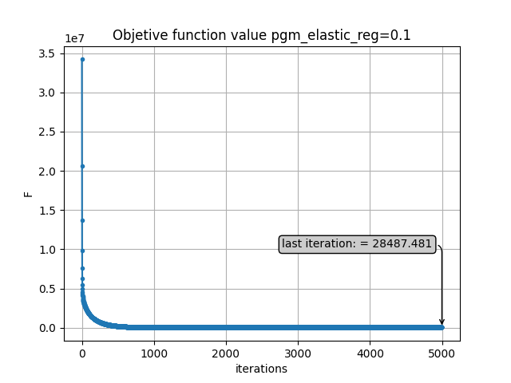
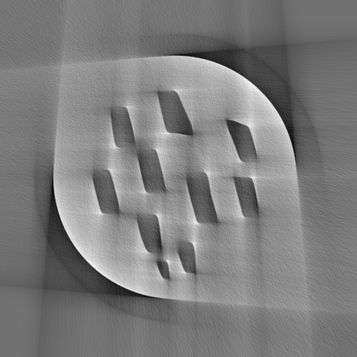

# Homework Sheet 5

## Part 1: Setup

### Result reproducability:

In homework 1, 2, 3, see notebook1.ipynb for the of methods in the homework 3 on simple least square problem.

Run script1.py to reproduce results of homework 1, 2 for simple phantom problem.

Run script2.py to reproduce results of homework 1, 2 challenge dataset

Run script3.py to reproduce results of homework 3 for simple phantom problem.

Run script4.py to reproduce results of homework 4 for simple phantom problem.

## Part 2: Experimental methods and results

### Homework 1&2: Proximal Operators & Proximal Gradient Method

See GradientDescent.py and ProximalOperator.py in aomip for details on the implementation. One thing to clarify in my notation is that I always use $\beta$ as L2 regularization parameter; $\tau$ as L1 regularization parameter and $\delta$ as regularization parameter for Huber. This is in contrast to the $\lambda$  notation used for l2 norm squared in the homework sheet equation (4).

#### Simple Least square problem

To illustrate the performance of the algorithm, a simple 2 dimensional least square problem of the form Ax=b is solved, where A = [2 1; 1 1] and b = [1; 1] and the solution x is supposed to be [0; 1]. the starting point is chosen to be [15,15]. The algorithm are evaluated based on the closeness to the solution and its iteration number. Illustration and explanations are provided in the notebook, please refer to it for more information.

#### CT reconstruction 

16 experiments are performed to demonstrate the various methods implemented in homework 1 and 2 and also the various problem formulation, all initial starting point are set to random value between 0 and 1. Translation vector y is a 1 vector.

| Experiment | Optimization Algorithm    | Proximal Operator   | Parameters   |
| :---:   | :---: | :---: | :---: |
| 1 | pgm | $l^2$-norm squared| $\beta=1$
| 2 | pgm   |  Huber  | $\beta$=1, $\delta$=10
| 3 | fpgm   |  $l^2$-norm squared  | $\beta=1$, $\alpha_1$ 
| 4 | fpgm   | $l^2$-norm squared    | $\beta=1$, $\alpha_2$ 
| 5 | fpgm   | Huber    | $\beta$=1, $\delta$=10, $\alpha_1$ 
| 6 | fpgm   | Huber    | $\beta$=1, $\delta$=10,$\alpha_2$ 
| 7 | pgm   |  Translation, g:$l^2$-norm squared  | $\beta=1$
| 8 | pgm   | Constant functional   | $\beta=1$
| 9 | fpgm   |  Constant functional   | $\beta=1$, $\alpha_1$ 
| 10 | fpgm   |  Constant functional   | $\beta=1$, $\alpha_2$ 
| 11 | pgm   |  Constant functional   | $\beta$=1, $\delta$=10
| 12 | fpgm  |    Constant functional | $\beta$=1, $\delta$=10
| 13 | pgm  |   ElasticNet | $\tau$=0.1, $\beta$=0.1
| 14 | pgm  |   ElasticNet | $\tau$=0.01, $\beta$=0.01
| 15 | fpgm  |   ElasticNet | $\tau$=0.1, $\beta$=0.1
| 16 | fpgm  |   ElasticNet | $\tau$=0.01, $\beta$=0.01

**table 1**

*Abbreviation:*
1. proximal gradient Method: pgm  
2. Fast proximal gradient method: fpgm  
3. momentum parameter 1 $\alpha_k=\frac{k-1}{k+2}$: $\alpha_1$  
4. momentum parameter 2 $\alpha_k=\frac{t_{k-1}-1}{t_k}$: $\alpha_2$  

**Reconstruction result**

    
    
    
    
    
    
    
    
    
    
    
    
    
    
    
    

**Convergence analysis**

    
    
    
    
    
    
    
    
    
    
    
    
    
    
    
    

 
**Objective function value**

    
    
    
    
    
    
    
    
    
    
    
    
    
    
    
    

 
**Figure 1-16, following the order of the experiment in table 1 above from left to right. If unsure, hover over each diagram to read the description**

#### Challenge dataset

5 experiments are performed to investigate the performance of the newly implemented optimization agains previously implemented methods on limited-angle ($90^\circ$) tomography problem, phantom 5a is chosen to illustrate the result. Momentum term 2 are chosen for all experiments since it offers better result in previous experiments

| Experiment | Optimization Algorithm    | Proximal Operator   | Parameters   
| :---:   | :---: | :---: | :---: |
| 1 | fpgm | $l^2$-norm squared | $\beta=1$, $\alpha_2$ 
| 2 | fpgm   |  Huber  | $\beta$=1, $\delta$=10, $\alpha_2$ 
| 3 | pgm   |  Constant functional  | $\beta=1$, $\delta=10$ 
| 4 | fpgm   | Constant functional    | $\beta=5$, $\alpha_2$ 
| 5 | fpgm   | Elastic net    | $\tau$=0.1, $\tau$=0.1, $\alpha_1$ 

**table 2**

    
    
    
    
    

Ultimately, the reconstructed image from experiment 4 was chosen and submitted to the leaderboard as it gives the best results among all. 

### Homework 3: Restart conditions

#### Simple Least square problem

*please refer to notebook1.ipynb *

#### CT reconstruction 

The algorithm takes in a variable that determines it should restart after every k iteration. the ranges are chosen between 250 and 1000 to illustrate how changing this paramter affect the convergence. 

| Experiment | Optimization Algorithm    | Proximal Operator   | Restart(Iteration) | Parameters   
| :---:   | :---: | :---: | :---: | :---: |
| 1 | fpgm | $l^2$-norm squared | False | $\beta=1$, $\alpha_1$ 
| 2 | fpgm   |  $l^2$-norm squared  | True(500)| $\beta$=1, $\alpha_1$ 
| 3 | fpgm   |  $l^2$-norm squared  | True(250) | $\beta=1$, $\alpha_1$ 
| 4 | OGM1 (Tikhonov)   |  - | False | $\beta=1$ 
| 5 | OGM1 (Tikhonov)   | -  | True(500) | $\beta$=0.1
| 6 | OGM1 (Tikhonov)    | -  | True(250) | $\beta$=0.1
| 7 | Barzilai and Bowein 1 (Tikhonov)  | - | False | $\beta=1$ 
| 8 | Barzilai and Bowein 1 (Tikhonov)  | - | True(500) | $\beta$=0.1
| 9 | Barzilai and Bowein 1 (Tikhonov)  | - | True(250) | $\beta$=0.1

**table 3**

**Reconstructed results**

    
    
    
    
    
    
    
    
    

**Convergence analysis**

    
    
    
    
    
    
    
    
    

**Objective function value**

    
    
    
    
    
    
    
    
    

For OGM1, it can be seen that if starting the algorithm every 250 iteration, it converges faster than when its restart every 500 iterations or without restart. Here, this particular setting leads to convergence in about 750 iterations. Convergence here means the reconstruction error: $|x_n-x_{n-1}|<1e-6$

#### Challenge dataset

5 experiments are performed to investigate the performance of the newly implemented optimization agains previously implemented methods on limited-angle ($90^\circ$) tomography problem, phantom 6a is chosen to illustrate the result. All algorithm below are restarted every 500 iterations

| Experiment | Optimization Algorithm    | Proximal Operator   |  Parameters   
| :---:   | :---: | :---: | :---: |
| 1 | fpgm | $l^2$-norm squared |  $\beta=1$, $\alpha_1$ 
| 2 | fpgm |  Huber |  $\beta$=1, $\delta$=10, $\alpha_1$ 
| 3 | fpgm |  Constant functional  |  $\beta=1$ (tikhonov), $\alpha_1$ 
| 4 | fpgm | Elastic Net  |  $\tau$=0.1; $\beta$=0.1; $\alpha_1$ 
| 5 | fpgm | Barzilai and Bowein 1 (Tikhonov)  | $\beta$=0.1

**table 4**

**Reconstructed results**

    
    
    
    
    

The results achieved here are worse than the experiments performed without restart condition, eg: Table 2. For the challenge dataset, the elastic net formulation does not reconstruct any meaningful results. This is in contrast to the experiments performed with the Sheep-Logan phatom, where image is reconstructed although the results doesn't match the other results of other experiments where problems are reformulated differently. Perhaps the problem is not supposed to be formulated in such a way or its just a result of poor parameter usage.

