# Homework Sheet 6

## Part 1: Setup

### Result reproducability:

For homework 1, 3, refer to notebook1.ipynb for homework 1 for simple least square problem and simple reconstruction using filtered back projection of the mayo clinic dataset.

For homework 2, refer to hw06/XFLM_exercise/3D_recon.ipynb

Run script1.py to reproduce results of homework 1 for simple Sheep-Logan phantom problem.

Run script2.py to reproduce results of homework 1, 2 mayo clinic dataset. 

### Dataset:

In homework 1 & 3, *L333_flat_fan_projections_fd.tif* is used as full dose dataset while *L096_flat_fan_projections_qd.tif* is used as low dose dataset.

## Part 2: Experimental methods and results

### Homework 1: Proximal Optimized Gradient Method (POGM)

#### Simple Least square problem

POGM, PGM and fast PGM (from the last homework) is used and compared against to solve a LASSO problem. Similar 2D least square problem is used as in past assignment to compare their performance in terms of accuracy, speed of convergenve and oscillatory behaviour, where A = [2 1; 1 1] and b = [1; 1] and the solution x is supposed to be [0; 1]. the starting point is chosen to be [15,15]. In the notebook, it can be seen that POGM does has 2x convergence rate better than PGM in terms of iteration number at 309 against 647. However, surprisingly fast pgm is still 2x quicker than POGM and 4x quicker than PGM with 129 iterations to convergenve. POGM also seems to have a more direct route to convergence. Despite its quick convergence, fpgm is less accurate than both PGM and POGM.

#### CT reconstruction 

5 experiments are performed to compare POGM agains PGM and fast PGM for the LASSO problem and for L2 squaerd norm. All initial starting point are set to random value between 0 and 1. $\tau$ is always used as a regularization parameter for L1; $\beta$ is used to denote regularization parameter for $l^2$ (tikhonov regularization); $\delta$ denotes the regularization parameter for Huber and Fair Potential.

| Experiment | Optimization Algorithm    | Proximal Operator   | Parameters   |
| :---:   | :---: | :---: | :---: |
| 1 | pgm | $l^1$| $\tau=1$
| 2 | fpgm   |  $l^1$  | $\tau$=1
| 3 | pogm   |  $l^1$ | $\tau=0.1$
| 4 | pogm   | $l^2$-norm squared    | $\beta=1$
| 5 | pgm   | $l^2$-norm squared   | $\beta$=1

**table 1**

*Abbreviation:*
1. proximal gradient Method: pgm  
2. Fast proximal gradient method: fpgm  
2. Proximal optimized gradient method: fogm  

**Reconstruction result**

    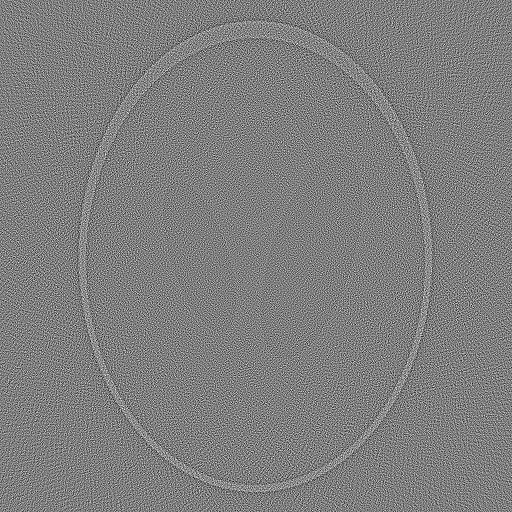
    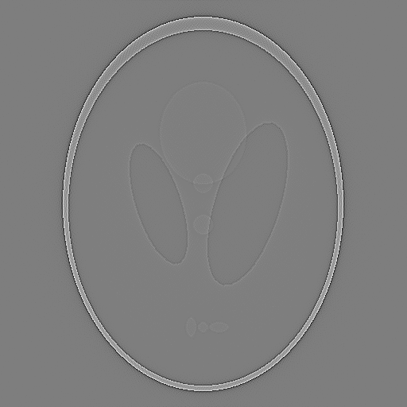
    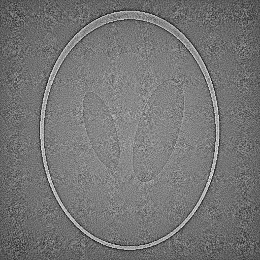
    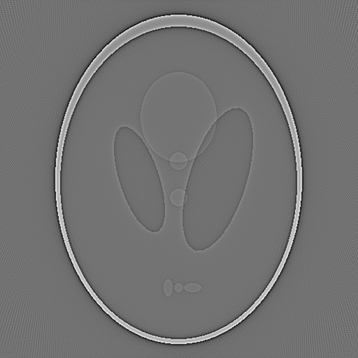
    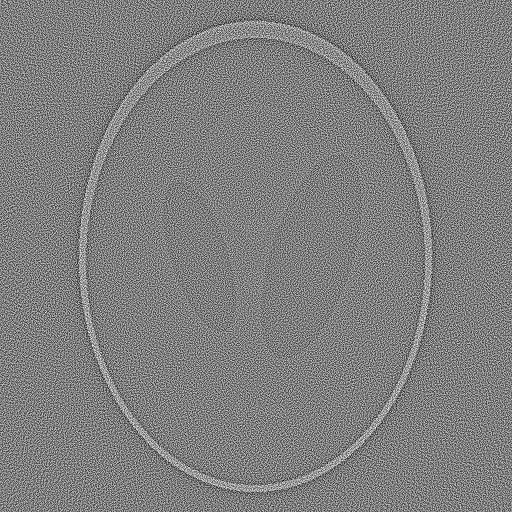

**Convergence analysis**

    
    
    
    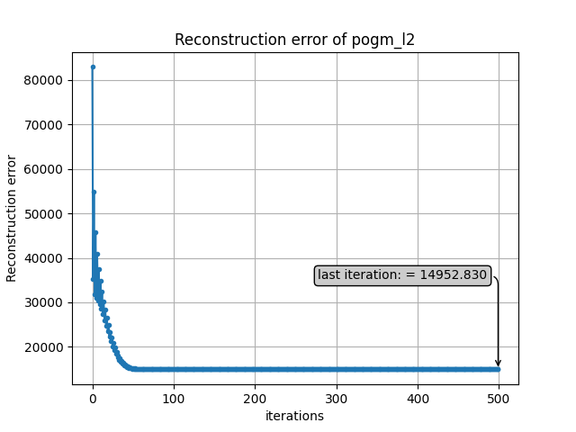
    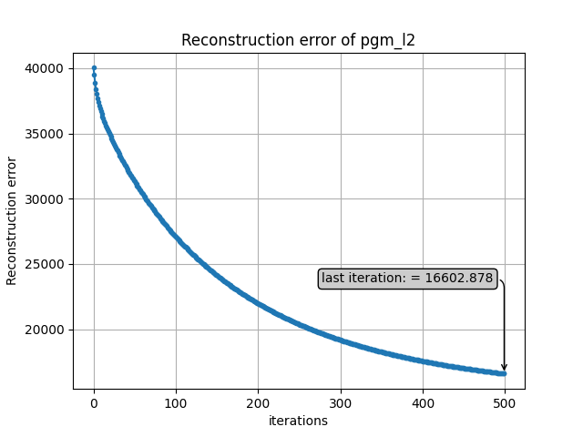

 
**Objective function value**

    
    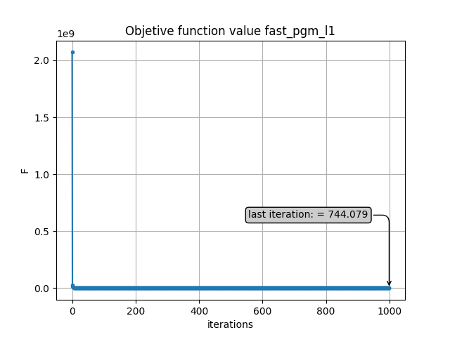
    
    
    

 
**Figure 1-5, following the order of the experiment in table 1 above from left to right. If unsure, hover over each diagram to read the description**

<u>**Observation:**</u>

In the lasso problem, the pogm algorithm exhibit a wild oscillation although it still converges faster than pgm. Eg: after 10 iterations, pgm has an error norm of about 32500 while its 10665.623 for pogm. Fo l2 norm, the speend of convergence is even more pronounecd as shown in the diagram. 

### Homework 3:  Low Dose X-ray CT

as the dataset is a 3d tensor of shape (x,y,z), from my understanding it corresponds of a 3d sinogram. Hence, 1 of slice of the sinogram is extractef to perform the reconstruction. An index can be passed to the function getSinogram to determine the slice of the sinogram from the data, is it then preprocessed using the code snippet given in the homework. On of the restriction is that the large angles renders a very large forward operator, causing memory allocation problem in the server. Therefore, the trick is to sample only every second angles.

Taking a look at the notebook, the reconstruction is performed using the well known filtered backprojection algorithm for both full-dose (fd) and quarter-dose (qd) datasets. More detailed explanation along with the reconstructed illustratation can be found in the notebook.

#### Iterative reconstruction 

Reconstruction using tranmission log likelihood and using the Gaussian least square model is performed and compared. In the former, the gradient term is replaced with equation (5) in the worksheet: $A'(y-be^{-Ax})$ while in the latter its just the gradient of least square. Experiment 1-8 corresponds to reconstruction with tranmission log likelihood while experiment 9-13 corresponds to reconstruction using the Gaussian least square model. The experiments are run for 5000 iterations.

| Experiment | Optimization Algorithm    | Proximal Operator   | dosage (full/quarter) | Parameters   
| :---:   | :---: | :---: | :---: | :---: |
| 1 | pogm | Huber | full | $\beta=1$, $\delta=1$ 
| 2 | pogm   |  $l^2$-norm squared   | full| $\beta$=5,
| 3 | OGM1   |  -  | full | tikhonov, $\beta=5$
| 4 | bb2   |  - | full | tikhonov, $\beta=0.1$ 
| 5 | pogm   | Huber  | quarter | $\beta=1$, $\delta=5$ 
| 6 | pogm   |  $l^2$-norm squared  | quarter | $\beta=1$
| 7 | OGM1  |  - | quarter | tikhonov, $\beta=0.1$ 
| 8 | bb2   | -  | quarter | tikhonov, $\beta=0.1$ 
| 9 | pogm   |  Huber | full | $\beta=1$, $\delta=1$ 
| 10 | bb2  | -  | full | tikhonov, $\beta=1$ 
| 11 | pogm   |  Huber | quarter | $\beta=1$, $\delta=5$ 
| 12 | pogm   |  $l^2$-norm squared   | quarter | $\beta=1$ 
| 13 | bb2   | -  | quarter | tikhonov, $\beta=1$ 

**Table 2 **

**Reconstructed results**

    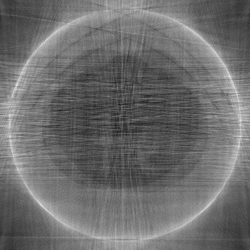
    
    
    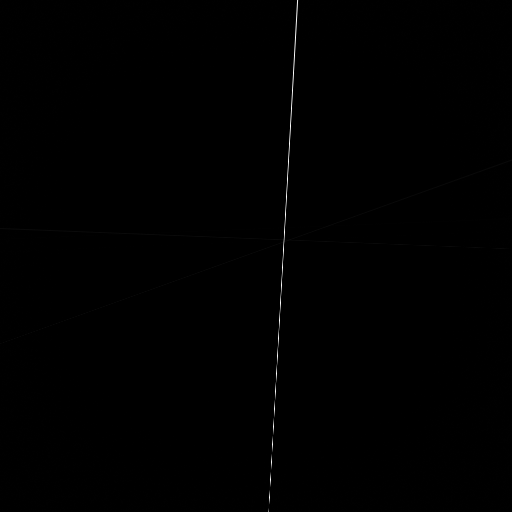
    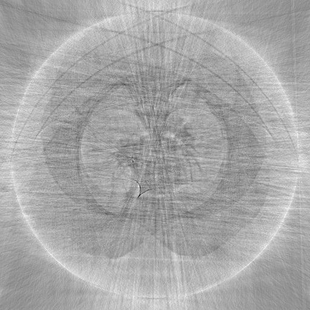
    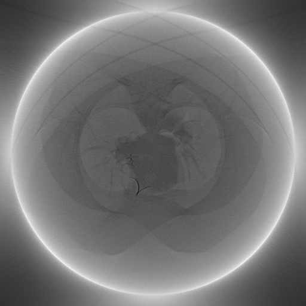
    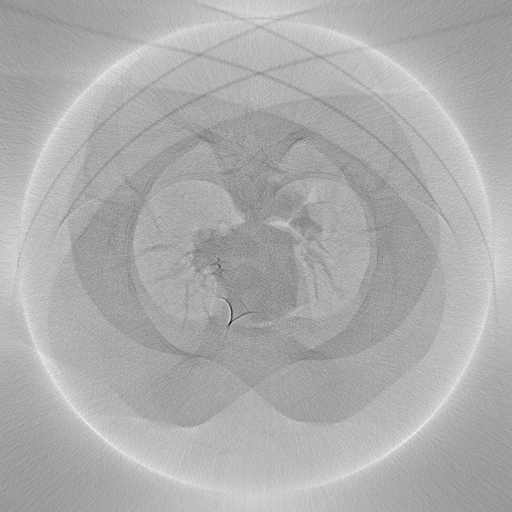
    
    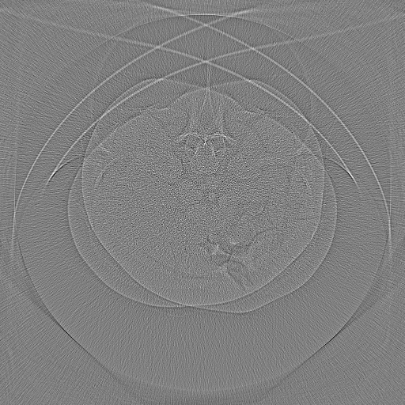
    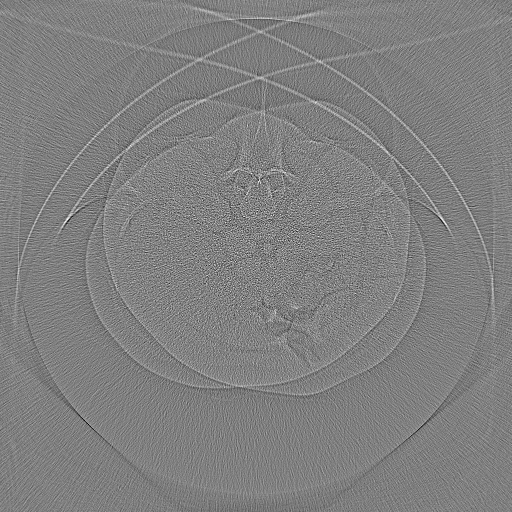
    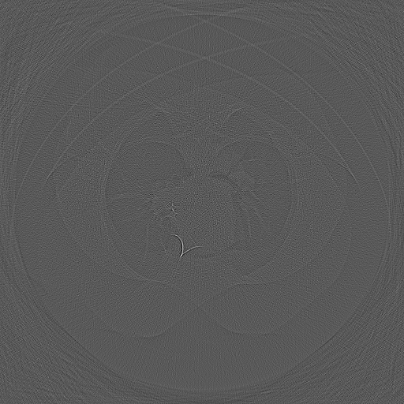
    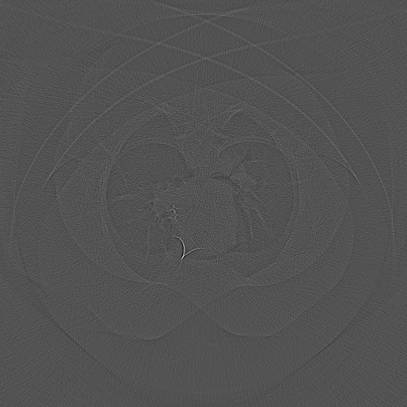
    

**Figure 1-13, following the order of the experiment in table 2 above from left to right. If unsure, hover over each diagram to read the description**

<u>**Observation:**</u>

My finding shows that for low dose case, tranmission log likelihood performs better than Guassian least square. However, its the opposite for full dose case. The reconstructions shows that the round shadowed artifacts are still present in each of the discernible reconstructed image. Taking experiments 5,6,7, the edges of both the lobes quite clear and the colour contrast is also better. This is in contrast to the reconstruction using Guassian least square, where the overall colour is a darker gray although the 2 lobes are still barely discernible. On the other hand, for the full dose case, experiment 1 (transmission log likelohood) doesn't reconstruct the image very well, there are serious artifacts rendering the internal of the object barely recognizable but the overall shape is comparable to the better reconstruction in experiment 9 and 10.

### Homework 4:  Corrections

In the last homework, there are some mistakes in the contour plot in hw05notebook1.ipynb where I commit again in this homework. A wrong variable is used causing the plotting to be wrong. If interested, please take a look at the notebook again. For more description, please read the readme from the last homework sheet for homework 1.

