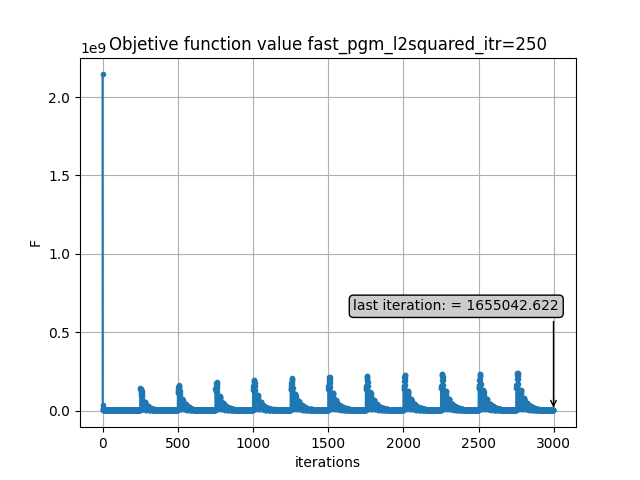

# Homework Sheet 7

## Part 1: Setup

### Result reproducability:

For homework 2 (iii) - Lasso Problem, refer to hw07notebook.ipynb for ADMM to solve lasso problem on a simple least square problem; and run script1.py to perform reconstruction on the challenge dataset.

For homework 2 (ii) - TV regularization, run script2.py to solve this problem on the synthetic dataset; run script3.py to solve this problem on the challenge dataset

**Extra** - run script3_restart_condition.py to test the restart condition on the sheep logan phantom.

## Part 2: Experimental methods and results

### Homework 1:  More Proximal Operators

The L2,1 norm is implemented as the function proximalL21 in ProximalOperator.py

### Homework 2 (iii): LASSO Problem  

#### 2D Least Square problem

Refer to hw07notebook.ipynb for results and explanations.

#### CT reconstruction on challenge datasets

In the linearized ADMM implementation, f(x) and g(z) are updated seperately and the proximal operator of f is L1, soft-thresholding. For g(z), the L2 norm proximal operator is used which is translated by b, the sinogram measurement. The problem can be defined as g(z) = f(x-y), hence, the proximal operator with translation b is implemented as b + $prox_g$(Ax-b) where the prox g here is L2 Norm squared. Phantom 6b from the challenge dataset is used for this experiment and reconstructed is performed on full angle (360) and limited angle (60) tomography

**Full angle $360^{\circ}$**

    
    
    
    
    
    
    
    
    
    

**Limited angle $60^{\circ}$**

    
    
    
    
    
    
    
    
    
    

**1e-5 to 1e+4 from left to right, if unsure, hover over the diagram**

<u>**Analysis and observation:**</u>

In this formulation, smaller regularization term for the lasso typically performs better. From regularization parameter of tau=1e-1 onwards, the reconstruction results have been garbage. Reasons could be in the implementation of the soft thresholding, if the threshold value is too large, everything will evaluate to 0. Hence, better parameter selection should be used to test for parameter around the 1e-5 to 1e-2 range.

### Homework 2 (ii): TV Regularization

The Stack operator uses the data structure of a list so that arbitrary number of operators could be added to the list. Then, the apply and adjoint operator will loop through each block of the list and apply the forward or adjoint operator for each operator, where in this case 2 operators are stacked which are the Xray transform (A) and Finite Difference gradient operator, since g(x) is splitted into $g_1$(x) and $g_2$(x), where the former is the least square term and the latter the TV regularization term. The results of the stacked operator is again a stack where proximal operator can be applied seperated to each block in the stack as in equation (14). In addition, there are also the addition, subtraction and scalar multiplication operator that is applied individually to each block in the stacked operator where its functions resemble a linear operator, eg, matrix operation. This is needed the variable term in the ADMM update stack are all a stackOperator object. In addition, since f(x)=0, the constant functional is applied to this update step, eg, the $x_{k+1}$ update step in equation (7) to  satisfy the condition f(x)=c where c is an element of R.

#### Synthetic image reconstruction

The synthethic image of size 256x256 generated using the code in the homework sheet is used in this experiment. Both anisotrophic, using the L11 norm and isotropic, using the L21 norm proximal operator are applied and compared. The reconstruction error for both the aforementioned case is plotted and its convergence is analysed. Taken a hint from previous reconstruction result, smaller regularization parameter tau is used which ranges from 1e-6 to 1e+1. Please refer to hw07notebook.ipynb to refer to the original image (groundtruth), the sinogram, and backprojection image.

<u>**Anisotropic case**</u>

    
    
    
    
    
    
    
    

    
    
    
    
    
    
    
    

<u>**Isotropic case**</u>

    
    
    
    
    
    
    
    

    
    
    
    
    
    
    
    

**1e-6 to 1e+1 from left to right, if unsure, hover over the diagram**

<u>**Analysis and observation:**</u>

The results are quite surprising since the results of the Anisotropic and Isotropic cases are the same. However, a valid explanation has yet to be found to explain this phenomena. Satisfactory reconstructions are achieved with TV regularization parameter of 1e-4 to 1e+1, this shows that regularization parameter that are either too small or too large has a negative effect on the reconstruction results. Analysing the reconstruction error of succesful reconstructed images, it shows a linear relationship with regularization parameter of 1 performs the best.

#### Challenge dataset reconstruction

Here the functional is formulated as an Anisotropic TV problem, hence, the L11 norm will be used and also its resulting proximal operator which is the soft-thresholding . Limited angle tomographic reconstruction of $60^{\circ}$ and $30^{\circ}$ are performed using this this formulation and the method of this section. TV regularization parameter tau is used which ranges from 1e-5 to 1e+4

**Limited angle $60^{\circ}$**

    
    
    
    
    
    
    
    
    
    

**Limited angle $30^{\circ}$**

    
    
    
    
    
    
    
    
    
    

<u>**Analysis and observation:**</u>

Compared to admm with lasso, the reconstruction is not too ideal as the border is not too clearly defined. In addition, the interior looks very fade although the overall shape is still well defined.

### Extra: corrections

Corrections are made to the restart condition as there is a mistake in the previous implementation, such that x0 is not set to the current iterate. Please refer to hw05_restart_correction.ipynb to illustrate the application of restart condition to a 2D least square problem.

#### CT reconstruction with sheep logan phantom

| Experiment | Optimization Algorithm    | Proximal Operator   | Restart(Iteration) | Parameters   
| :---:   | :---: | :---: | :---: | :---: |
| 1 | fpgm | $l^2$-norm squared | True(1000) | $\beta=1$, $\alpha_1$ 
| 2 | fpgm   |  $l^2$-norm squared  | True(500)| $\beta$=1, $\alpha_1$ 
| 3 | fpgm   |  $l^2$-norm squared  | True(250) | $\beta=1$, $\alpha_1$ 

**Reconstructed results**

    
    
    

**Convergence analysis**

    
    
    

**Objective function value**

    
    
    

<u>**Analysis and observation:**</u>

Restarting with 500 iteration gives the best result in terms of reconstruction result and error, as seen from the reconstruction error plot after each restart the subsequent convergence are rather similar. This is in contrast to when 250 or 1000 iterations are used where the error amplified after each restart.

## Part 3: Conclusion and future improvement

The results from this exercise are rather mixed. Although the reconstruction works it doesn't necessarily produces the best results when compared to algorithm learned in the prior lessons such as Fast PGM or POGM.

Besides, random selection of the regularization parameter doesn't always produces the best reconstruction as evident by the blank reconstruction with some of the choices of parameter. Perhaps in the future a better choice would be to set $\lambda$ and then find the $\tau$ value as stated in the homework sheet. However, this is not implemented yet due to time constraints. 

Moreover, it is still unclear why the same results are obtained for both anisotrophic and isotrophic cases although I have numerically verified that both proximal operator gives different output results from a small input, eg: on a 2x2 matrix. Hence, more should be looked into this to verify if there are error in the implementation.

Finally, one thing I learned tremendously in this exercise is to think in terms of operator operation as evidence by implementing the stacked operator. Looking back, I tend to always perform those operateration in terms of matrix vector multiplication instead of applying operator as I am more familiar with that paradigm. eg, I always implement A'(Ax-b) in matrix multiplication instead and forward and adjoint operator operations. However, I have changed this in this exercise and I have been using the operator implementation throughout this exercise.

