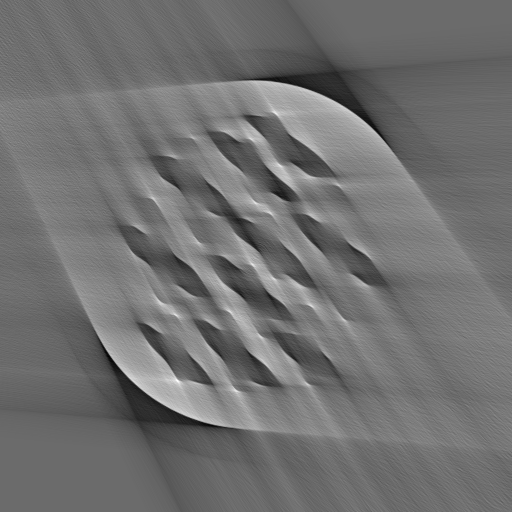
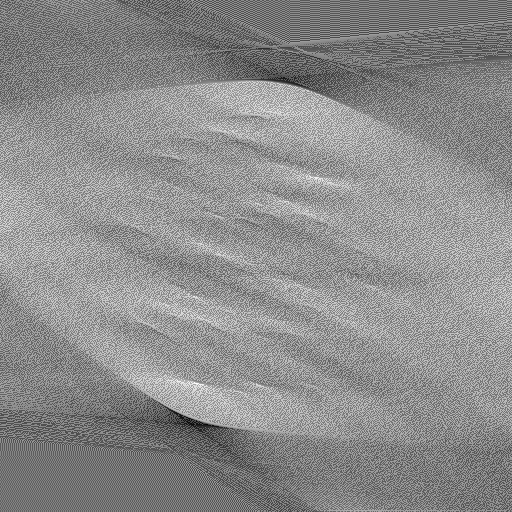

# Homework Sheet 8

## Part 1: Setup

### Result reproducability:

Refer to hw08notebook.ipynb for subgradient method on 2D least square problem, analysis of step length, and convergence analysis.

Homework 1, 2: Run script1.py, script2.py, script3.py, script4.py, I will elaborate which of the following sections corresponds to which script.

## Part 2: Experimental methods and results

In this section, I combine all homework 1,2,3 together, which means subgradient method (homework 1) to compare against selected prior method (comparsion part of homework 1) to perform reconstruction on the challenge dataset (homework 2) as well as a small part on low dose dataset reconstruction. The results of my presentation (homework 3) will all come from homework 1 and 2 of this week. Hence, homework 1, 2, 3 are all mixed up and thus the sections will be divided into respective recontructed image.

In the following section, $\tau$ is always used as a regularization parameter for L1 and TV regulariztion; $\beta$ is used to denote regularization parameter for $l^2$ (tikhonov regularization) and huber; $\delta$ denotes the regularization parameter for Huber and Fair Potential; $\alpha_k$ is to denote step size; L is the Lipschitz constant. Convergenve criteria is where norm of $x_n$ - $x_{n-1}$ < 1e-6, In other words, when the norm of current iterate and the previous iterate is 1e-6.

### Challenge dataset: phantom 7a with limited angle ( $60^{\circ}$)

Refer to script1.py for this section. Furthermore, 0 is used as an initialization point for the all experiments. 

| Experiment | Optimization Algorithm    | Proximal Operator/ Regularization   | Parameters   | iterations (Until convergenve) | running time (seconds)
| :---:   | :---: | :---: | :---: | :---: | :---: |
| 1 | Subgradient | TV | $\tau$=0.01, fixed $\alpha_k$=0.01 | 5000 | 69.35283851623535
| 2 | Subgradient   |  TV  |  $\tau$=0.01, variable $\alpha_k=\frac{1}{k}$ (k=5000) | 5000 | 74.70258712768555
| 3 | ADMM   |  $l^2$-norm squared and $l^1$-norm | $\tau$=0.001, $\lambda=\frac{0.95\tau}{L^2}$ (k=5000) | 3000 | 57.06966423988342
| 4 | FPGM | $l^2$-norm squared  | $\beta$=5,$\alpha_k=\frac{1}{L}$ |  | 28.48592233657837
| 5 | POGM | $l^2$-norm squared  | $\beta$=10, $\alpha_k=\frac{1}{L}$ | 24 | 1.261713981628418
| 6 | ISTA | $l^1$-norm   | $\tau$=0.01, $\alpha_k=\frac{1}{L}$ | 3000 | 31.162291526794434
| 7 | bb2 | $l^2$-norm squared  | $\beta$=5 |  28 | 1.7747914791107178
| 8 | ISTA | $l^1$-norm   | $\tau$=0.01, $\alpha_k=\frac{1}{L}$ | 5000 | 54.936132192611694
| 9 | FPGM | $l^1$-norm   | $\tau$=1, $\alpha_k=\frac{1}{L}$ | 5000 | 54.45972013473511

**table 1**

    
    
    
    
    
    
    
    
    

**Figure 1-9, following the order of the experiment in table 1 above from left to right. If unsure, hover over each diagram to read the description**

### Challenge dataset: phantom 7c with limited angle ( $60^{\circ}$)

Refer to script3.py for this section. Furthermore, 0 is used as an initialization point for the all experiments. 

| Experiment | Optimization Algorithm    | Proximal Operator/ Regularization   | Parameters   | iterations (Until convergenve) | running time (seconds)
| :---:   | :---: | :---: | :---: | :---: | :---: |
| 1 | Subgradient | TV | $\tau$=0.01, fixed $\alpha_k$=0.01 | 5000 | 70.0524640083313
| 2 | Subgradient   |  TV  |  $\tau$=0.01, variable $\alpha_k=\frac{1}{k}$ (k=5000) | 5000 | 74.77692556381226
| 3 | ADMM   |  $l^2$-norm squared and $l^1$-norm | $\tau$=0.001, $\lambda=\frac{0.95\tau}{L^2}$ (k=5000) | 5000 | 95.65959763526917
| 4 | FPGM | $l^2$-norm squared  | $\beta$=5, $\alpha_k=\frac{1}{L}$ | 5000 | 48.26965141296387
| 5 | POGM | $l^2$-norm squared  | $\beta$=10, $\alpha_k=\frac{1}{L}$ | 24 | 0.26660776138305664
| 6 | ISTA | $l^1$-norm   | $\tau$=0.01, $\alpha_k=\frac{1}{L}$ | 10000 | 105.28181767463684
| 7 | bb2 | $l^2$-norm squared  | $\beta$=5  |  28 | 1.8306841850280762 

**table 2**

    
    
    
    
    
    
    

**Figure 1-7, following the order of the experiment in table 2 above from left to right. If unsure, hover over each diagram to read the description**

### Challenge dataset: phantom 7c with limited angle ( $30^{\circ}$)

Refer to script2.py for this section. Furthermore, 0 is used as an initialization point for the all experiments.

| Experiment | Optimization Algorithm    | Proximal Operator/ Regularization   | Parameters   | iterations (Until convergenve) | running time (seconds)
| :---:   | :---: | :---: | :---: | :---: | :---: |
| 1 | Subgradient | TV | $\tau$=0.01, fixed $\alpha_k$=0.01 | 5000 | 66.18613982200623
| 2 | Subgradient   |  TV  |  $\tau$=0.01, variable $\alpha_k=\frac{1}{k}$ (k=5000) | 5000 | 66.18613982200623
| 3 | ADMM   |  $l^2$-norm squared and TV | $\tau$=0.001, $\lambda=\frac{0.95\tau}{L^2}$ (k=5000) | 5000 | 187.92652583122253
| 4 | FPGM | Huber | $\beta$=1, $\delta$=10, $\alpha_k=\frac{1}{L}$ | 5000 | 50.826568841934204
| 5 | POGM | $l^2$-norm squared  | $\beta$=10, $\alpha_k=\frac{1}{L}$ | 22 |  0.23142337799072266
| 6 | ISTA | $l^1$-norm   | $\tau$=0.01, $\alpha_k=\frac{1}{L}$ | 8000 | 75.92918658256531
| 7 | bb1 | $l^2$-norm squared  | $\beta$=5  |  26 | 1.7756826877593994

**table 3**

    
    
    
    
    
    
    

**Figure 1-7, following the order of the experiment in table 3 above from left to right. If unsure, hover over each diagram to read the description**

**<u>Analysis and observation</u>**

As seen from the reconstructed image above, ISTA with low regularization parameter (~0.01) tends to perform the best reconstruction that achieves the best score on the leaderboard. Despite other methods such as Barzilai and Bowein, FPGM and POGM  with L2 norm manage to reconstruct the object in the middle fairly better than ISTA, it fails to achieve the dark background which is the desired properties to achieve a good score on the leaderboard. Also, Barzilai and Borwein and POGM converges very quickly in terms of iteration numbers which makes it ideal in terms of computation time, as evidence by the sub 1 second time needed to perform a reconstruction with the GPU,

Regarding subgradient method with TV regularization, the performance is sufficient but does not beat most of the methods in the previous homework. In hw08notebook, although fixed step sizes seems to perform better on 2D case and the phantom experiment, but it is the opposite here where variable step length triump fixed step length in terms of the quality of the reconstructed image.

### Mayo Clinic low dose dataset

Reconstruction is performed by replacing the least square term with the tranmission log likelihood a regularization term. The gradient of the least square term $A'(y-be^{-Ax})$ while in the latter its just the gradient of least square. b is chosen to be 1 here although 1e+8 in worksheet 6 due to be better reconstruction results. Also note that, the value 1 for b was used in worksheet 6 despite but it was mistakenly written as 1e+8  because I realized that I forgot to multiply the value b to the gradient term.

| Experiment | Optimization Algorithm    | Proximal Operator/ Regularization   | Parameters   | iterations (Until convergenve) | running time (seconds)
| :---:   | :---: | :---: | :---: | :---: | :---: |
| 1 | Subgradient | TV | $\tau$=0.001, fixed $\alpha_k$=0.01 | 2000 | 71.6659243106842
| 2 | Subgradient   |  TV  |  $\tau$=0.001, variable $\alpha_k=\frac{1}{k}$ (k=2000) | 5000 | 181.41402339935303
| 3 | POGM | Huber | $\beta$=1, $\delta$=5, $\alpha_k=\frac{1}{L}$ | 2000 | 69.2211275100708
| 4 | POGM  |  $l^2$-norm squared | $\beta$=1, $\lambda=\frac{1}{L}$ | 1589| 56.85691261291504

**table 4**

    
    
    
    

**Figure 1-4, following the order of the experiment in table 3 above from left to right. If unsure, hover over each diagram to read the description**

### Homework 3: Presentation

See Final Presentation.pdf

## Part 3: Conclusion and future improvement

After learning and implemeting various optimization methods, parameterizing the algorithm and especially the regularization parameter heavily influeces the reconstruction results. Although I have gained some knowledge of the range of regularization strength to use on different regularizer (eg: L1, L2, Huber, Fair), I still do not have a systematic way of applying regularization strength and it just boils down to random guessing in the beginning as well as trial and error. 

There are many things in my implementation that can be improved. Fist of all, the code structure is rather messy as the goal of each exercise is geared towards a proof of concepts in the worksheet instead of developing a fully functional software. Hence, I hope the result reproducibility section in the beginning of the readme will guide the reader towards relevent section that produce the results in section 2. Furthermore, there is no way to guarantee the implemented algorithms are bug free, that is reason I always apply it on a 2D least square problem in each homework to ensure that it neither deviates too far from the actual solution nor converges in an exorbitant rate.

